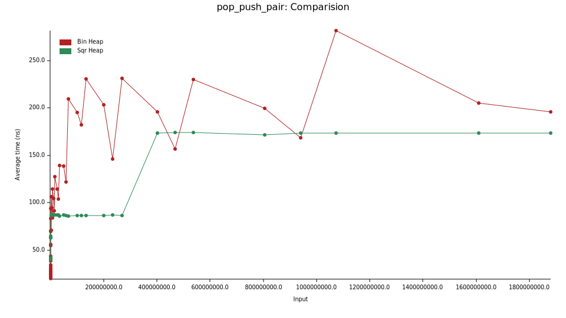
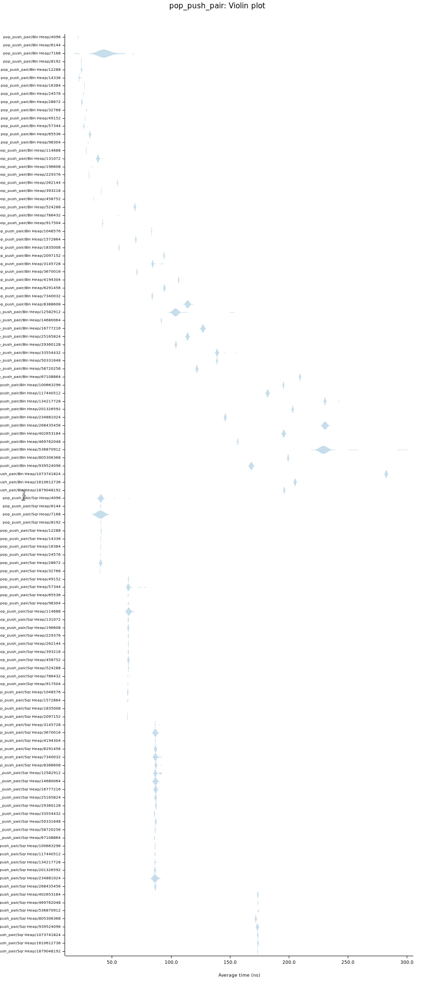

# Square Heap

#### Priority Queue with better scaling

A square heap, as opposed to a binary heap is one where the number of children at each level is
squared. That is, the root has two children. Each of those two children has four children,
meaning a total of 8 children at the next level. Then 64 children for the next layer, and so
forth.

## But why?
The number of nodes when a tree is full at a given height is

```
nodes(h) = (0..h).fold(0, |acc, n| acc + 2**(n * (n+1)/2))
```

We can bound the number of nodes by the top value:
```
nodes(h) >= 2**(h * (h+1)/2)
```

Thus, we can approximate the height given the number of nodes as
```
n >= 2**(h * (h+1)/2)
log(n) >= (h * (h+1)/2) where log is base 2
2 log(n) >= h * (h+1)
0 >= h^2 + h - 2 log(n)
let k = 2 log(n)
h >= (-1 +/- sqrt(1 + 4k))/2 using the quadratic formula
h >= (-1 + sqrt(1 +4k))/2 since it must be that h > 0

Throwing out constants
h >~ sqrt(1 + 8 log(n))/2
```


Thus, we find that the height will increase incredibly slowly with respect to the number of
nodes.

##### Cost of push

The cost of a push operation is directly proportional to the height of the tree. Thus, we find
that it has a better expected run time than a pop operation on a binary heap.

##### Cost of pop/delete-min

Intuitively, the cost of operations in binary heaps are incurred due to traversal up and
down the heap. Our heap attempts to mitigate that by making the heap shorter but fatter. Of
course, there is an additional cost now because there is more than one children that needs to
be checked. Thus, we also must count the number of comparisons as a function of height.

```
#comparisons(h) = (0..h).fold(0, |acc, n| acc + 2**n)
                = h * (h+1)/2;
```

Thus, we find the number of comparisons as a function of the number of nodes to be approximately
equal to:
```
#comparisons(n) ~ (1 + 8 log(n))/8 + other lower order terms
#comparisons(n) ~ log(n)
```

Thus we find the comparisons here are also on the order of log(n).
So... there was no point in doing this.

Well, we do find a point in doing this. The cost incurred as the size of a priority queue
increases actually starts to depend more on memory, since there are often large jumps in indices
between different heights because the index change is exponential. Thus, it becomes harder for
the memory to prefetch the index of the next child. For most use cases, this is never reached,
as the cache line will be big enough. At a certain point though, it will start to hit a ceiling
where it will be necessary to go back to main memory to fetch the next child.

We dodge that problem by having fewer levels, and instead relying more on linear scans. Linear
scans also make good use of memory prefetching, so we expect having linear scans to be cheaper
than having to do large amounts of pointer chasing after some point. "After some point" means
that we expect it to incur some cost, but after making the heap large enough it will become
cheaper.

The trade-off comes in a couple forms: First, there is a little bit higher memory overhead. For
a binary heap, using a given index we can compute the child or the parent. I couldn't come up
with an easy way to do that for this scheme(although it might exist), so we must track the depth
of the last child along with how wide we expect the last level to be.

There is also an additional computational trade-off because we can't easily compute the next
child's index. Thus, there are a lot more numerical operations that occur at each level. Some of
these can be reduced using lookup tables, but there is always a little more overhead here.

Both of these stem from the fact that there isn't an immediate way to compute the index of the
child or the parent given an arbitrary index. With that, it would nullify these downsides.

It's also possible adding look-up tables or the like would be more efficient, but that's less
fun now isn't it?

### I don't believe you, show me some proof.

You right, it's all just fun until you can actually show good evidence that what you claim is
true. Unfortunately, there is no direct way to compare two data structures and see which is
better.

Consider this benchmark which shows that in certain cases a square heap might
be better suited than a binary heap in a practical use case. If you don't believe that it's
actually useful, fair enough, I can't convince everyone.

Fix the size of the heap to be some constant `l`. Then, pop from the top of the heap, and push
the element back on the heap. For both binary heaps and square heaps, this will force a sift up
and down the heap for each iteration. Thus, this should test the raw speed of each without any
other interference.




Please note the large scale of the input size. For smaller input sizes, the binary heap can
outperform the square heap. It is quite interesting how widely the binary heap's perform varies,
while the square heap's performance is consistent at each height. Such consistency at this level
is quite nice for getting consistent performance when using a priority queue as a building
block.

If you would like to test for yourself, clone this repo and run `cargo bench`, or for a fully
optimized build, `make opt`. Your results
might vary from mine, as they are dependent on the architecture you are running them on.
Notably, these results are from a machine with an older i7 core. Initially I could not reproduce
these results on a multi-core architecture where each core is not as powerful, but after adding
in multiple optimizations, I found it to be replicable elsewhere.

If you find results that contradict these, please submit a github issue. That is much more
interesting than those that agree with them.

### Should I use this repo?

Absolutely not. The API here is a bare-bones skeleton intended to demonstrate the feasibility of
a square heap. It's still missing a bunch of pleasantries such as iterators and other nice
functions which the standard library has.

### Inspiration

The main inspiration for this data structure are [fibonacci
heaps](https://en.wikipedia.org/wiki/Fibonacci_heap), which intend to be much more
efficient than binary heaps. The main practical issue with fibonacci heaps is that they make use
of linked-lists, and do not have prescribed sizes, so they end up incurring a cost in memory
accesses. While that makes fibonacci heaps impractical for small use cases, the idea that we can
vary the number of children in order to gain some benefit is one that hasn't been explored as
much. Square heaps are intended to be predictable, variable child, heaps, which don't cast aside
memory concerns.

### Lessons

While working on this, I learned some interesting things about the toolchain that I'm using.
Specifically, I realized that the cost at each height was increasing at a much higher cost than
I expected, and I suspected this was due to bounds checks when comparing children in the
sift-down function.
In order to see if this was the case, I used the [godbolt compiler
explorer](https://rust.godbolt.org/) to directly view the assembly. Strangely, it did not notify
me that I needed to have a specific instantiation of types in order for my code to actually
appear(Heap\<i32\> vs Heap\<T\>), and appeared to compile it in debug mode, or at least I assume
so because there were so many runtime checks which I would hope don't appear in a release build.

From this, I could tell that it was at least compiling bounds checks in what I assumed to be
debug mode, so I just extrapolated and assumed that it was compiling bounds checks in release
mode.

I initially tried to mess around with asserts to get it to remove bounds checks, but I
couldn't find any way, so I just stuck `get_unchecked` into the accesses and saw a 40% reduction
in runtime. Which is pretty incredible. It went from much worse performance compared to binary
heaps to reasonably better. I then stuck in `get_unchecked` in a lot of different places and saw
a significant perf gain. I'm not sure how to justify using unsafe vs. safe but the perf gain
from these changes is non-trivial and warrants the use of it.


